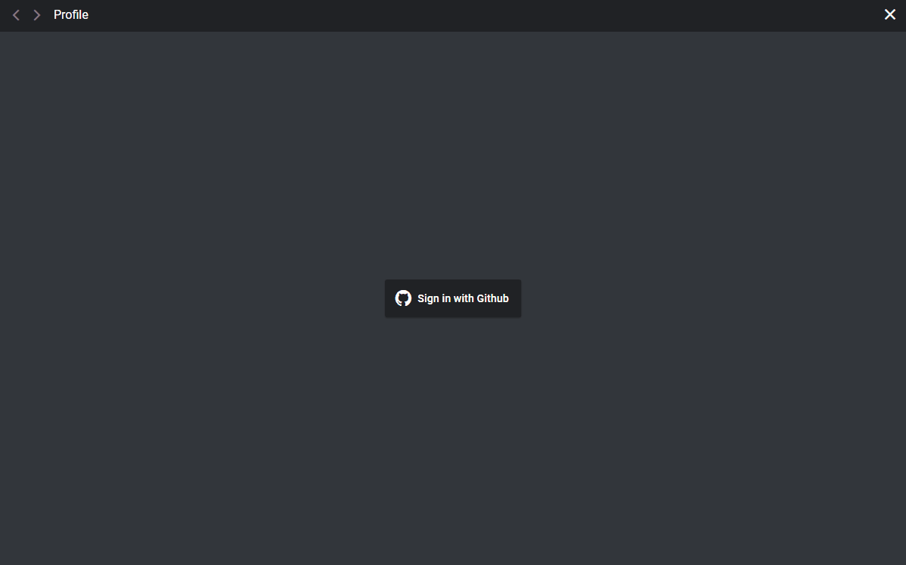

# Gitssue

Chrome extension - Allows you to manage issues outside of Github

## Install

- [Chrome extension](https://chrome.google.com/webstore/detail/gitssue/iagekpbdeollpioaefgfkjfdogeofjcf?hl=ko)

## Highlights

| UI focused on issue management |
| :-------------: |
|  | 

| Support Tab/UnTab when using editor |
| :-------------: |
|  | 

| Capture using chrome api & google drive api |
| :-------------: |
|  | 

## Q & A

- Q: Why is the name Gitssue?
  -  A: Manage **Git**hub's I**ssue**
- Q: Why did you make this?
  - A: I felt it was frustrating to be able to write an issue only inside Github, and I did not feel comfortable managing issues in multiple repositories

## TODO

- Manage issue
  - Notification by desktop message, if user want
- UI 
  - Customizable position & resizing by user
  - Tab design when viewing multiple issue (like 'vscode')
- Editor like notepad
    - File upload
    - ctrl + z, ctrl + y for undo/redo      
    - autosave
